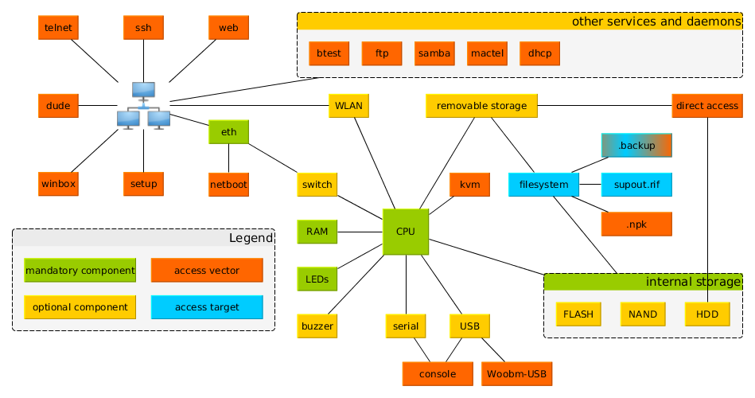

# 🔐 MikrotikAPI-BF v2.1

[](https://www.python.org/downloads/)
[](LICENSE)
[](docs/CHANGELOG.md)
[](README.md)

Advanced CLI toolkit for security testing of Mikrotik RouterOS and CHR. It performs credential testing against multiple entry points (RouterOS API/REST-API) with optional post-login validation on network services (FTP/SSH/Telnet), includes robust session persistence, progress/ETA, export, stealth, and fingerprinting.

## ✨ Key Features

### 🔐 Authentication Targets
- **RouterOS API** (TCP 8728) — proprietary binary protocol
- **REST-API** over **HTTP/HTTPS** (TCP 80/443) — Basic Auth
- Full TLS support for HTTPS

### 🛡️ Post-Login Service Validation
- **FTP** (TCP 21)
- **SSH** (TCP 22)
- **Telnet** (TCP 23)
- Custom ports supported per service (e.g., `--validate ssh=2222`)

### 🔄 Persistent Sessions
- Resume from the last attempt, JtR-like behavior
- Duplicate test avoidance for the same target/services/wordlist
- ETA calculation based on average attempt time
- Session listing and inspection

### 🥷 Stealth Mode
- Fibonacci-based randomized delays
- User-Agent rotation and randomized headers
- Jitter to avoid timing signatures

### 🔍 Fingerprinting
- RouterOS version, device model, open ports, services
- Basic risk scoring and observations for exposure

### 📊 Progress & Export
- Deterministic progress bar with ETA and speed
- Export in JSON, CSV, XML and TXT

### 🎯 Smart Wordlists
- Target-informed combinations, BR-focused lists supported locally by the user

## 🚀 Quick Start

### Prerequisites
- Python 3.8–3.12 (3.12.x recommended)
- Windows, Linux, or macOS

### One-liners
```bash
# Basic
python mikrotikapi-bf-v2.1.py -t 192.168.1.1 -U admin -P 123456

# With wordlists (provide your own, not tracked in repo)
python mikrotikapi-bf-v2.1.py -t 192.168.1.1 -u wordlists/users.lst -p wordlists/passwords.lst

# With post-login validation
python mikrotikapi-bf-v2.1.py -t 192.168.1.1 -u users.lst -p passwords.lst --validate ftp,ssh,telnet

# Full pentest-style run
python mikrotikapi-bf-v2.1.py \
  -t 192.168.1.1 \
  -u wordlists/users.lst \
  -p wordlists/passwords.lst \
  --validate ftp,ssh,telnet \
  --stealth --fingerprint --progress --export-all \
  --threads 5 -vv
```

### Installation
```bash
git clone https://github.com/mrhenrike/MikrotikAPI-BF.git
cd MikrotikAPI-BF
pip install -r requirements.txt
python mikrotikapi-bf-v2.1.py --help
```

## 🧭 Services Tested and Why Winbox/WebFig Are Not

### Supported services (tested correctly)
- API (8728) — binary login via `_api.py`
- REST-API (80/443) — HTTP Basic Auth against `/rest/system/identity`
- FTP/SSH/Telnet — functional post-login validation using standard clients

### Not supported (and why)
- **Winbox** (TCP 8291): proprietary GUI protocol; there is no reliable, legal, and portable Linux/Python library to emulate the Winbox login handshake. Previous attempts typically degenerate into port-open checks, producing false positives — therefore intentionally removed.
- **Web Console (WebFig)**: on target CHR builds it frequently responds `406 Not Acceptable` for automated requests and/or requires dynamic flows not stable for programmatic auth. This produces false positives/negatives; therefore removed to avoid misleading results.

## 🧱 Modern CHR Defenses You Will Hit
- Session controls and server-side antifraud for auth flows
- Request limits and rate-limiting per source
- Temporary account lockouts and backoff windows
- Extensive logging (auth failures, rate limiting, HTTP 4xx/5xx)
- IDS/IPS/NAC and WAF-likes in front of HTTP endpoints

You should expect throttling and evidence in logs during testing. Prefer stealth mode, sensible thread counts, and authorized maintenance windows.

## 🗺️ Attack Surface Mapping

Understanding where MikrotikAPI-BF operates within the Mikrotik ecosystem is crucial for effective security testing. The following diagram illustrates the complete attack surface of Mikrotik RouterOS devices:

<div align="center">



*Mikrotik RouterOS Ecosystem Map - Attack Surface Visualization*

</div>

### 🎯 **Our Tool's Focus Areas**

**Access Vectors (Orange boxes in diagram):**
- **`api`** - RouterOS API (TCP 8728) - Binary protocol for automation
- **`web`** - REST-API endpoints (TCP 80/443) - HTTP/HTTPS with Basic Auth
- **`ssh`** - Secure Shell (TCP 22) - Encrypted remote access
- **`telnet`** - Unencrypted remote access (TCP 23) - Legacy protocol
- **`ftp`** - File Transfer Protocol (TCP 21) - File management

**Access Targets (Blue boxes in diagram):**
- Network services and daemons bound to the CPU
- Management interfaces and authentication systems
- **NOT** internal storage or removable media (those require physical access)

### 🔍 **Why These Attacks Are Possible**

1. **Network Exposure**: These services are intentionally exposed for management and automation
2. **Authentication Endpoints**: Each service provides interactive login capabilities
3. **Legacy Support**: Many services remain enabled for backward compatibility
4. **Automation Requirements**: API/REST endpoints are needed for device management

### 🛡️ **How to Defend Against These Attacks**

**Immediate Actions:**
- **Disable unused services** (telnet, ftp if not needed)
- **Restrict management access** to specific networks using firewall rules
- **Enable strong authentication** (SSH keys, complex passwords)
- **Implement rate limiting** and account lockouts

**Advanced Defenses:**
- **Network segmentation** - Isolate management interfaces
- **VPN access only** - Require VPN connection for management
- **Multi-factor authentication** where supported
- **Regular security updates** and credential rotation
- **Monitoring and logging** - Watch for brute-force attempts

**Modern CHR Defenses:**
- Session controls and request limits
- Per-source rate limiting and temporary lockouts
- Extensive logging of authentication failures
- WAF/IPS protection for HTTP endpoints

## 📄 CLI Essentials

Common flags:
- `--validate ftp,ssh,telnet` — post-login validation with optional custom ports (`ssh=2222`).
- `--resume | --force | --list-sessions | --session-info` — session control.
- `--stealth` — stealth delays and header rotation.
- `--progress` — progress bar with ETA.
- `--export json,csv,xml,txt | --export-all` — reporting.

## 📁 Project Layout

```
MikrotikAPI-BF/
├── mikrotikapi-bf-v2.1.py
├── _api.py  _log.py  _session.py  _export.py  _progress.py  _stealth.py  _fingerprint.py  _wordlists.py
├── docs/
│   ├── README.md  API_REFERENCE.md  INSTALLATION.md  USAGE_EXAMPLES.md  index.html  CHANGELOG.md  FEATURES.md  QUICKSTART.md  VERBOSE_GUIDE.md
├── requirements.txt  install-v2.1.sh
└── .gitignore
```

## ⚠️ Legal Notice and Responsible Use
- Use only on systems you own or have explicit, written authorization to test.
- Your tests will likely be logged; coordinate with stakeholders.
- Respect rate limits, user privacy, and applicable laws.

## 🔧 Troubleshooting (Quick)
- Python 3.13+ may deprecate stdlib modules (e.g., `telnetlib`); prefer 3.12.x.
- For connection timeouts: check routing, firewall, and service ports.
- For REST-API TLS issues: use `--ssl` and confirm certificates where appropriate.

## 📚 Documentation
- [Full Documentation](docs/README.md)
- [API Reference](docs/API_REFERENCE.md)
- [Installation Guide](docs/INSTALLATION.md)
- [Usage Examples](docs/USAGE_EXAMPLES.md)
- [HTML Docs](docs/index.html)

## 🆕 What’s New in v2.1
- Persistent sessions (resume, ETA, duplicate avoidance)
- Stealth mode (Fibonacci delays, UA rotation)
- Advanced fingerprinting
- Post-login validation for FTP/SSH/Telnet
- Multi-format export and improved progress UI
- Removed unreliable Winbox/WebFig testing

## Support
- GitHub: https://github.com/mrhenrike/MikrotikAPI-BF
- Issues: https://github.com/mrhenrike/MikrotikAPI-BF/issues

Licensed under MIT. See `LICENSE`.