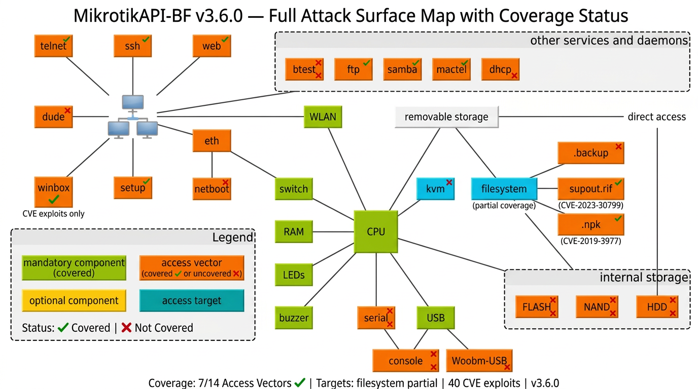
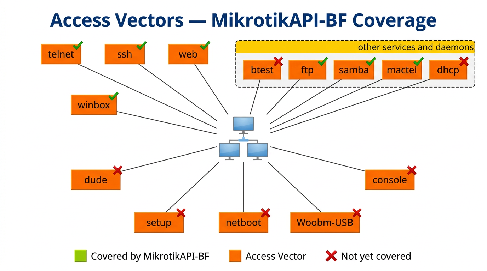
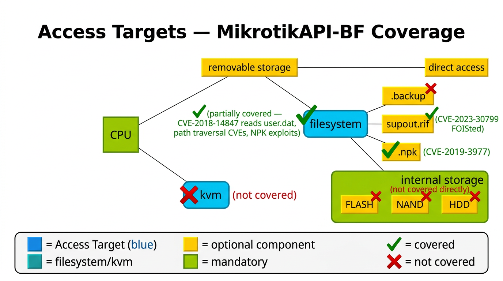

# MikrotikAPI-BF v3.5.3 (pt-BR)

[](https://www.python.org/downloads/)
[](LICENSE)
[](https://github.com/mrhenrike/MikrotikAPI-BF/releases/tag/v3.5.3)
[](README.md)
[](https://github.com/mrhenrike/MikrotikAPI-BF/wiki)
[](https://pypi.org/project/mikrotikapi-bf/)
[](https://github.com/mrhenrike/MikrotikAPI-BF/actions/workflows/codeql.yml)

**Framework de Ataque e Exploração RouterOS** — força bruta de credenciais, **40 exploits CVE/EDB com PoC**, descoberta MAC-Server Layer-2, decodificadores offline de credenciais, analisador NPK, scanner CVE, scripts Nmap NSE, multi-alvo, stealth, vetores API/REST/Winbox/FTP/SSH/Telnet/SMB/SNMP/BFD/OSPF.

**English:** [README.md](README.md) · **Contribuição:** [CONTRIBUTING.md](CONTRIBUTING.md) · **Conduta:** [CODE_OF_CONDUCT.md](CODE_OF_CONDUCT.md) · **Segurança:** [SECURITY.md](SECURITY.md)

---

## ✨ Principais Funcionalidades

### 🔐 Autenticação e Força Bruta
- **RouterOS API** (TCP 8728/8729) — protocolo binário completo (6.x MD5 challenge + 7.x plaintext)
- **REST API** via HTTP/HTTPS (TCP 80/443) — força bruta Basic Auth
- **MAC-Telnet** (TCP 20561) — protocolo proprietário Layer-2 (sem IP necessário)
- **Multi-alvo** (`--target-list / -T`) — escanear a partir de arquivo
- **Threading** — até 15 workers (`--threads N`)

### 🔍 Scanner CVE e Engine de Exploits
- **40 classes de exploit** — 22 CVEs + 2 design findings + 13 PoCs Exploit-DB + 5 novos CVEs
- **Exploits pre-auth** — Winbox (CVE-2018-14847, CVE-2018-10066), HTTP traversal, SNMP, SMB, BFD, OSPF, DNS
- **Exploits post-auth** — RCE via Scheduler, escalonamento Container, FOISted, extração chave WireGuard, wiretapping via packet sniffer
- **Ciente de versão** — banco de dados CVE mapeia aplicabilidade à versão RouterOS detectada
- **`--scan-cve`** — scan CVE standalone (sem força bruta)

### 🌐 Cobertura Winbox (TCP 8291)
- **CVE-2018-14847** — Divulgação de credenciais (Chimay-Red / EternalWink) — leitura de arquivo pre-auth
- **CVE-2018-10066** — Bypass de autenticação / directory traversal
- **CVE-2021-27263** — Bypass de auth (RouterOS 7.0.x)
- **CVE-2018-14847-MAC** — Mesmo exploit via descoberta MNDP Layer-2
- **Script NSE** — `nse/mikrotik-winbox-cve-2018-14847.nse`

> ℹ️ **Força bruta** Winbox via protocolo GUI proprietário não implementada (sem biblioteca portável). Use porta API 8728. Todos os **exploits CVE Winbox** (leitura de arquivo pre-auth, bypass) estão plenamente implementados.

### 🛰️ MAC-Server / Descoberta Layer-2 (v3.3.0+)
- **Broadcast MNDP** (UDP 20561) — descobre dispositivos mesmo sem IP
- **Força bruta MAC-Telnet** (TCP 20561)
- **CVE-2018-14847-MAC** — divulgação de credenciais via dispositivos descobertos por MNDP
- **Restrição L2** — requer mesmo domínio de broadcast

### 🔓 Decodificadores Offline de Credenciais (v3.5.0+)
- **`--decode-userdat`** — decodifica `user.dat` após extração via CVE-2018-14847 (XOR com chave MD5)
- **`--decode-backup`** — extrai arquivo `.backup` + auto-decodifica credenciais
- **`--decode-supout`** — lista seções em `supout.rif`
- **`--analyze-npk`** — analisador de pacotes NPK (vetor CVE-2019-3977)

### 🗺️ Scripts Nmap NSE (v3.5.3+)
- `mikrotik-routeros-version.nse` — fingerprint RouterOS via HTTP/API/Winbox
- `mikrotik-api-brute.nse` — força bruta completa da API (auth 6.x MD5 + 7.x plaintext)
- `mikrotik-default-creds.nse` — testa credenciais padrão/vazias
- `mikrotik-api-info.nse` — dump autenticado (usuários, serviços, firewall)
- `mikrotik-winbox-cve-2018-14847.nse` — verifica divulgação de credenciais Winbox

---

## 🚀 Início Rápido

### Instalar via pip

```bash
pip install git+https://github.com/mrhenrike/MikrotikAPI-BF.git
# ou (quando no PyPI):
pip install mikrotikapi-bf

mikrotikapi-bf --help
mikrotikapi-bf --nse-path    # caminho dos scripts NSE para o Nmap
```

### Instalar do código-fonte

```bash
git clone https://github.com/mrhenrike/MikrotikAPI-BF.git
cd MikrotikAPI-BF
pip install -r requirements.txt
python mikrotikapi-bf.py --help
```

### Comandos rápidos

```bash
# Força bruta básica
python mikrotikapi-bf.py -t 192.168.1.1 -U admin -d wordlists/passwords.lst

# Listas de usuários + senhas
python mikrotikapi-bf.py -t 192.168.1.1 -u users.lst -p passwords.lst

# Multi-alvo a partir de arquivo
python mikrotikapi-bf.py -T targets.lst -d passwords.lst --threads 5

# Scan completo de CVEs (autenticado)
python mikrotikapi-bf.py -t 192.168.1.1 --scan-cve --all-cves -U admin -P senha

# Execução estilo pentest completo
python mikrotikapi-bf.py \
  -t 192.168.1.1 \
  -u wordlists/users.lst -p wordlists/passwords.lst \
  --validate ftp,ssh,telnet \
  --stealth --fingerprint --progress --export-all \
  --threads 5 -vv

# Decodificar user.dat após extração via CVE-2018-14847
python mikrotikapi-bf.py --decode-userdat user.dat --decode-useridx user.idx

# Ataque MAC-Server Layer-2
python mikrotikapi-bf.py --mac-discover --mac-brute -d passwords.lst
```

### Uso com Nmap NSE

```bash
# Instalar scripts NSE
cp nse/*.nse /usr/share/nmap/scripts/ && nmap --script-updatedb

# Descoberta completa
nmap -p 80,8291,8728 --script "mikrotik-*" 192.168.1.0/24

# Verificar CVE-2018-14847
nmap -p 8291 --script mikrotik-winbox-cve-2018-14847 192.168.1.1
```

---

## 🗺️ Mapeamento de Superfície de Ataque

### Superfície Completa — Status de Cobertura (v3.5.3)



*Superfície de ataque completa do RouterOS com indicadores de cobertura (✓ coberto / ✗ não coberto)*

### 🟠 Vetores de Acesso



| Vetor | Porta(s) | Cobertura | Como |
|-------|---------|----------|------|
| **telnet** | TCP/23 | ✅ Coberto | Validação pós-login |
| **ssh** | TCP/22 | ✅ Coberto | Validação pós-login + EDB-28056 |
| **web** (WebFig/REST) | TCP/80, 443 | ✅ Coberto | Força bruta REST + 10+ exploits CVE/EDB |
| **winbox** | TCP/8291 | ✅ Coberto | CVE-2018-14847, CVE-2018-10066, CVE-2021-27263 + NSE |
| **ftp** | TCP/21 | ✅ Coberto | Validação pós-login + CVE-2019-3976/3977 + EDB-44450 |
| **samba** (SMB) | TCP/445 | ✅ Coberto | CVE-2018-7445, CVE-2022-45315 |
| **mactel** (MAC-Telnet) | TCP/20561 | ✅ Coberto | `modules/mac_server.py` — MNDP + brute (v3.3.0+) |
| **dude** | TCP/2210 | ❌ Não coberto | The Dude — sem PoC |
| **setup/netboot** | UDP/5000 | ❌ Não coberto | Apenas acesso físico/LAN |
| **btest** | TCP/2000 | ❌ Não coberto | Protocolo não implementado |
| **dhcp/console/USB** | Vários | ❌ Não coberto | Fora do escopo ou acesso físico |

### 🔵 Alvos de Acesso



---

## 📄 Referência de Flags CLI

Consulte a [tabela completa de flags](README.md#-cli-reference-all-flags) no README em inglês ou o [Guia Completo (pt-BR)](https://github.com/mrhenrike/MikrotikAPI-BF/wiki/Complete-Usage-Guide-pt-BR) na wiki.

---

## 📖 Documentação

| Recurso | Link |
|---------|------|
| **Wiki GitHub (pt-BR)** | [Guia Completo](https://github.com/mrhenrike/MikrotikAPI-BF/wiki/Complete-Usage-Guide-pt-BR) |
| **Wiki GitHub (en-US)** | [Complete Usage Guide](https://github.com/mrhenrike/MikrotikAPI-BF/wiki/Complete-Usage-Guide) |
| **Cobertura EDB** | [EDB-Exploit-Coverage](https://github.com/mrhenrike/MikrotikAPI-BF/wiki/EDB-Exploit-Coverage) |
| **Scripts NSE** | [nse/README.md](nse/README.md) |
| **Política de Segurança** | [SECURITY.md](SECURITY.md) |
| **Changelog** | [Releases](https://github.com/mrhenrike/MikrotikAPI-BF/releases) |

---

## ⚠️ Aviso Legal

<!-- LEGAL-NOTICE-UG-MRH -->

- **Uso** — Apenas para educação, pesquisa e testes **explicitamente autorizados**. Não utilize contra sistemas sem permissão formal por escrito.
- **Sem garantia** — Fornecido **"no estado em que se encontra" (AS IS)** sob [Licença MIT](LICENSE).
- **Sem responsabilidade** — O(s) autor(es) **não respondem** por danos, uso indevido ou reclamações de terceiros. **O uso é por sua conta e risco.**
- **Atribuição** — Preserve avisos de copyright. Contribuições via **pull requests** e **issues** são bem-vindas.

---

## 💬 Suporte

- **GitHub:** [https://github.com/mrhenrike/MikrotikAPI-BF](https://github.com/mrhenrike/MikrotikAPI-BF)
- **Issues:** [https://github.com/mrhenrike/MikrotikAPI-BF/issues](https://github.com/mrhenrike/MikrotikAPI-BF/issues)
- **Wiki:** [https://github.com/mrhenrike/MikrotikAPI-BF/wiki](https://github.com/mrhenrike/MikrotikAPI-BF/wiki)

Licenciado sob MIT — ver [`LICENSE`](LICENSE).  
**Autor:** André Henrique ([@mrhenrike](https://github.com/mrhenrike)) · LinkedIn/X: `@mrhenrike`
